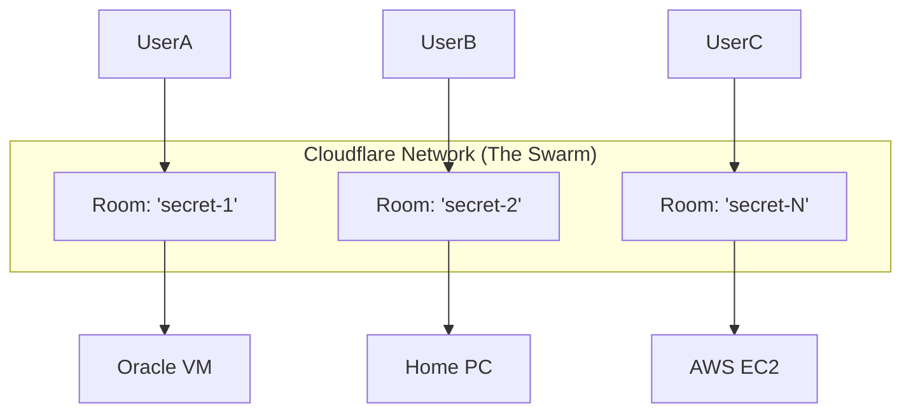

# ZKS-VPN Architecture Overview

## Core Concept: "Socket over WebSocket"
ZKS-VPN tunnels raw TCP/UDP sockets over standard HTTPS/WebSocket connections, allowing it to bypass restrictive firewalls and NATs.

## Components

### 1. ZKS Client (`zks-tunnel-client`)
- **Role**: The user's entry point.
- **Modes**:
  - `socks5`: Local proxy for browsers.
  - `vpn`: System-wide TUN interface (virtual network card).
  - `p2p-client`: Connects to an Exit Peer via Relay.
  - `exit-peer`: Acts as a gateway to the internet.
- **Encryption**: Generates Local Key (CSPRNG) for Vernam Cipher.

### 2. ZKS Relay (`zks-tunnel-relay`)
- **Platform**: Cloudflare Worker (Durable Objects).
- **Role**: Blind relay. Connects Client to Exit Peer.
- **Scalability**: Serverless. Spins up a new "Room" (Durable Object) for every connection pair.
- **Security**: Zero Knowledge. Cannot decrypt traffic (sees only `Ciphertext`).

### 3. ZKS Exit Peer
- **Role**: The bridge to the real internet.
- **Location**: Anywhere (Oracle Cloud, Home PC, Raspberry Pi).
- **Function**: Decrypts ZKS traffic -> Standard TCP/UDP -> Internet.

## The "Swarm" Scalability Model

The system is designed to handle thousands of concurrent peers through **Room Isolation**.

### Key Features
1.  **Isolation**: Room A cannot communicate with Room B. Each tunnel is a private universe.
2.  **Infinite Scaling**: Cloudflare automatically distributes Rooms across its global network. 10,000 users = 10,000 parallel processes.
3.  **No Bottlenecks**: Unlike a traditional VPN server (which slows down with more users), ZKS-VPN uses distributed edge computing.

## Security Model: Double-Key Vernam Cipher

$$ Ciphertext = Plaintext \oplus Key_{Local} \oplus Key_{Remote} $$

- **Key Local**: Held by Client.
- **Key Remote**: Held by Cloudflare (LavaRand).
- **Result**:
  - Cloudflare has Key Remote but lacks Key Local -> **Cannot Decrypt**.
  - ISP has neither -> **Cannot Decrypt**.
  - Exit Peer receives decrypted stream (via the tunnel) -> **Must Decrypt to forward**.

## Deployment

- **Relay**: `wrangler deploy` (Automatic via GitHub Actions).
- **Client/Exit**: `cargo build --release`.

## Performance: ZKS vs Tor

ZKS is designed to be **orders of magnitude faster** than Tor.

| Feature | Tor (The Onion Router) | ZKS-VPN | Why ZKS is Faster |
| :--- | :--- | :--- | :--- |
| **Network** | Volunteer Nodes (Home Internet) | **Cloudflare Backbone** (Fiber) | We use enterprise-grade infrastructure, not home DSL. |
| **Hops** | 3 (Entry -> Middle -> Exit) | **1** (Client -> Relay -> Exit) | Fewer hops = Lower latency. |
| **Bandwidth** | Shared with thousands of users | **Dedicated** (Your own VPS) | You get the full 1Gbps+ of your Oracle VM. |
| **Protocol** | TCP over TCP (Slow) | **WebSockets / UDP** (Fast) | Optimized for modern high-speed throughput. |

**Result**:
- **Tor**: ~2-5 Mbps, High Latency (200ms+).
- **ZKS**: **100 Mbps - 1 Gbps**, Low Latency (depends on location).

