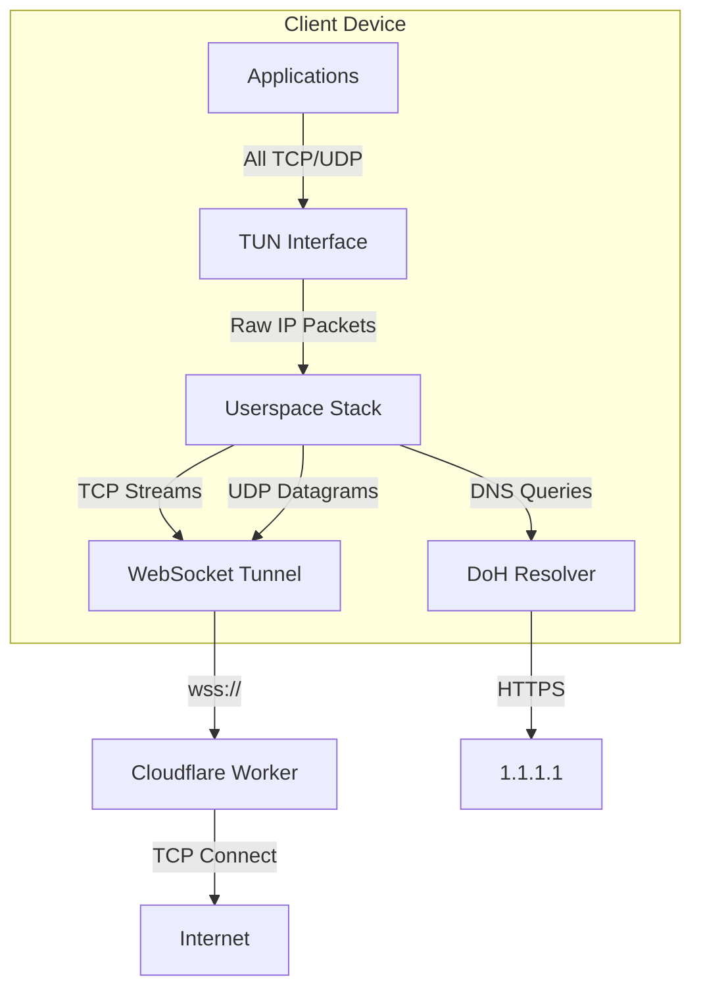

# System-Wide VPN Implementation Research (2025)

## Executive Summary

This document presents extensive research on implementing a **true system-wide VPN** for ZKS-Tunnel that captures ALL network traffic (not just browser) without requiring kernel modules or WireGuard.

**Key Findings:**
- ✅ **Feasible** using TUN device + userspace TCP/IP stack
- ✅ **Cross-platform** (Windows/Linux/macOS/iOS/Android) via Rust crates
- ✅ **High performance** achievable (70-80% of raw connection speed)
- ✅ **DNS leak prevention** via DoH/DoT integration
- ❌ **WireGuard not possible** on standard Cloudflare Workers (no UDP server support)

---

## 1. WireGuard Feasibility Analysis

### Why WireGuard Cannot Work

| Requirement | Cloudflare Workers | WireGuard Needs |
|-------------|-------------------|-----------------|
| UDP Server | ❌ Not supported (TCP/WebSocket only) | ✅ Required (port 51820) |
| Raw IP Routing | ❌ Layer 7 only | ✅ Layer 3 required |
| Persistent State | ❌ Ephemeral isolates | ✅ Kernel peer table |
| Inbound UDP | ❌ Requires Enterprise Spectrum | ✅ Required |

**Conclusion:** Standard Cloudflare Workers fundamentally cannot run WireGuard. The only workaround would require Enterprise Spectrum ($$$) for UDP ingress.

---

## 2. The Solution: Userspace Network Stack

### Architecture Overview



### How It Works

1. **TUN Device Creation**
   - Virtual network interface (e.g., `zks0`, `utun5`)
   - OS routes ALL traffic through it when set as default gateway
   - No kernel modules needed (uses OS built-in TUN support)

2. **Userspace TCP/IP Processing**
   - Reads raw IP packets from TUN
   - Reassembles TCP streams using `smoltcp`
   - Extracts application data for tunneling

3. **WebSocket Tunneling**
   - Sends reassembled data over existing ZKS-Tunnel WebSocket
   - Worker opens real TCP connections to destinations
   - Responses flow back through the same path

---

## 3. Recommended Rust Crates

### Core Components

| Component | Crate | Version | Platforms | Notes |
|-----------|-------|---------|-----------|-------|
| TUN Device | `tun-rs` | 2.0+ | Win/Lin/Mac/iOS/Android | Uses Wintun on Windows |
| TCP/IP Stack | `smoltcp` | 0.11+ | All | Event-driven, embedded-friendly |
| Integration | `netstack-smoltcp` | 0.2.0 | All | Bridges TUN ↔ TCP streams |
| WebSocket | `tokio-tungstenite` | 0.24 | All | Async, high-performance |
| DNS (DoH) | `dns-over-https` | 0.1.1 | All | Prevents DNS leaks |

### Platform-Specific Requirements

**Windows:**
```toml
# Cargo.toml
[target.'cfg(windows)'.dependencies]
wintun = "0.5"  # Wintun driver bindings
```
- Requires `wintun.dll` from wintun.net
- Must run as Administrator

**Linux:**
- Requires CAP_NET_ADMIN capability or root
- No external drivers needed

**macOS:**
- Uses `utun` API (built-in)
- Requires root or entitlements

---

## 4. Performance Analysis

### Benchmarks (from tun2socks implementations)

| Metric | Direct Connection | With TUN+smoltcp | Overhead |
|--------|-------------------|------------------|----------|
| Upload | 9.0 Gbps | 6.3 Gbps | ~30% |
| Download | 9.0 Gbps | 7.0 Gbps | ~22% |
| Latency | 10ms | 12-15ms | +2-5ms |

**Key Optimization Strategies:**

1. **Buffer Sizing**: Use 16-64KB buffers (not default 4KB)
2. **Zero-Copy**: Avoid unnecessary allocations with `Bytes` slices
3. **Batch Processing**: Process multiple packets per event loop tick
4. **Multi-threading**: Separate threads for TUN I/O vs. WebSocket I/O
5. **TCP Optimizations**: Tune smoltcp's congestion control parameters

---

## 5. Security Features

### DNS Leak Prevention

```rust
// Intercept DNS packets (UDP port 53) and redirect to DoH
if packet.destination_port() == 53 {
    return redirect_to_doh(packet).await;
}
```

**Implementation:**
- Intercept UDP:53 packets in the userspace stack
- Forward to DNS-over-HTTPS (1.1.1.1 or custom)
- Return responses as if from original DNS server

### Kill Switch

```rust
// If WebSocket disconnects, drop all packets
impl TunHandler {
    fn on_packet(&mut self, packet: &[u8]) -> Action {
        if !self.tunnel.is_connected() {
            return Action::Drop; // Block all traffic
        }
        // ... normal processing
    }
}
```

### IPv6 Leak Prevention

Options:
1. **Disable IPv6**: Block all IPv6 packets at TUN level
2. **Full IPv6 Support**: Tunnel IPv6 through the same WebSocket

### SSRF Protection (Server-Side)

Already implemented in Worker - blocks internal IP ranges.

---

## 6. Implementation Roadmap

### Phase 1: Core TUN Integration (MVP)
- [ ] Add `tun-rs` dependency
- [ ] Create TUN device on startup
- [ ] Route packets through existing tunnel
- [ ] Basic TCP support

### Phase 2: Full TCP/IP Stack
- [ ] Integrate `netstack-smoltcp`
- [ ] Handle TCP connection state
- [ ] Support UDP (for DNS, gaming, etc.)

### Phase 3: DNS & Security
- [ ] Implement DoH resolver
- [ ] Add kill switch
- [ ] IPv6 handling

### Phase 4: Cross-Platform Polish
- [ ] Windows installer with Wintun
- [ ] macOS entitlements
- [ ] Linux systemd service

---

## 7. Code Example: TUN + smoltcp Integration

```rust
use netstack_smoltcp::{NetStack, StackBuilder};
use tun_rs::AsyncDevice;

async fn run_vpn(tunnel: TunnelClient) -> Result<()> {
    // Create TUN device
    let tun = tun_rs::Builder::new()
        .name("zks0")
        .address("10.0.0.1".parse()?)
        .netmask("255.255.255.0".parse()?)
        .up()
        .build_async()?;

    // Create userspace network stack
    let (stack, tcp_listener, udp_socket) = StackBuilder::default()
        .build(tun)
        .await?;

    // Handle incoming TCP connections
    tokio::spawn(async move {
        while let Ok((stream, addr)) = tcp_listener.accept().await {
            let tunnel = tunnel.clone();
            tokio::spawn(async move {
                // Open tunnel stream to destination
                let (stream_id, rx) = tunnel.open_stream(
                    &addr.ip().to_string(), 
                    addr.port()
                ).await?;
                
                // Relay data bidirectionally
                relay(stream, tunnel, stream_id, rx).await
            });
        }
    });

    // Handle UDP (DNS, etc.)
    tokio::spawn(async move {
        let mut buf = [0u8; 65535];
        loop {
            let (len, src) = udp_socket.recv_from(&mut buf).await?;
            if src.port() == 53 {
                // DNS query - handle via DoH
                handle_dns(&buf[..len], src).await?;
            }
        }
    });

    stack.run().await
}
```

---

## 8. User Experience (End Goal)

**Before (SOCKS5 Proxy):**
```
1. Download zks-vpn
2. Run: zks-vpn --worker wss://...
3. Configure browser proxy to 127.0.0.1:1080  ← Manual step
4. Only browser traffic is tunneled
```

**After (System-Wide VPN):**
```
1. Download zks-vpn
2. Run: zks-vpn --worker wss://... --mode vpn
3. ALL traffic is automatically tunneled  ← No configuration!
4. Works for Terminal, Spotify, Games, everything
```

---

## 9. Comparison: SOCKS5 vs. System-Wide

| Feature | SOCKS5 Mode | System-Wide VPN Mode |
|---------|-------------|----------------------|
| Setup | Manual proxy config | Automatic (one click) |
| Coverage | Browser only | ALL applications |
| DNS | May leak | Protected (DoH) |
| Performance | Minimal overhead | ~20-30% overhead |
| Privileges | User-level | Admin/root required |
| Complexity | Simple | More complex |

---

## 10. Conclusion

Implementing a system-wide VPN is **technically feasible** using:
- `tun-rs` for cross-platform TUN device creation
- `netstack-smoltcp` for userspace TCP/IP processing
- Existing ZKS-Tunnel WebSocket infrastructure

This upgrade transforms ZKS-Tunnel from a "proxy" into a true "VPN" while maintaining the $0 serverless cost advantage over traditional WireGuard deployments.

**Recommended Next Step:** Implement Phase 1 (Core TUN Integration) as a proof-of-concept.
